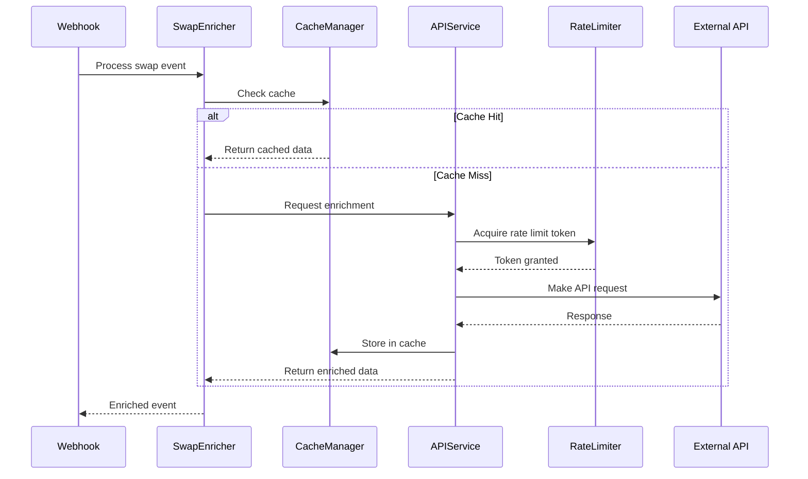

# API Enrichment Architecture Synthesis

**Created**: 2025-09-08
**Updated**: 2025-09-08 - Adopted Hybrid Paradigm
**Type**: Architecture Documentation
**Status**: Active Development
**Decision**: Hybrid Approach (Classes for Infrastructure, Functions for Business Logic)

## Executive Summary

This document captures the architectural synthesis of three key elements:
1. **ScanTrack's battle-tested patterns** - Production-proven approaches for API integration, caching, and rate limiting
2. **Modern TypeScript practices** - Type safety, generics, dependency injection, and SOLID principles
3. **Our implementation requirements** - Webhook processing, real-time enrichment, and scalability needs

The result is a hybrid architecture that combines the reliability of proven patterns with the maintainability and developer experience of modern TypeScript.

## Table of Contents

1. [Architecture Overview](#architecture-overview)
2. [Design Philosophy](#design-philosophy)
3. [Pattern Synthesis](#pattern-synthesis)
4. [TypeScript Enhancements](#typescript-enhancements)
5. [Implementation Architecture](#implementation-architecture)
6. [Key Design Decisions](#key-design-decisions)
7. [Migration from Original Spec](#migration-from-original-spec)

---

## Architecture Overview

### Layered Architecture Diagram

```
┌────────────────────────────────────────────────────────────────┐
│                         Webhook Layer                          │
│                    (Event Processing & Routing)                │
└────────────────────────────────────────────────────────────────┘
                                 │
                                 ▼
┌────────────────────────────────────────────────────────────────┐
│                      Enrichment Orchestrator                   │
│                  (SwapEnricher with DI Container)             │
└────────────────────────────────────────────────────────────────┘
                                 │
                    ┌────────────┴────────────┐
                    ▼                          ▼
┌─────────────────────────┐        ┌─────────────────────────┐
│     Service Layer       │        │      Cache Layer        │
│  (Typed API Services)   │◄──────►│   (Redis with TTL)      │
└─────────────────────────┘        └─────────────────────────┘
            │                                  │
            ▼                                  ▼
┌─────────────────────────┐        ┌─────────────────────────┐
│  Infrastructure Layer   │        │   Monitoring Layer      │
│  (Rate Limiting, Retry) │        │  (Metrics, Logging)     │
└─────────────────────────┘        └─────────────────────────┘
```

### Component Interaction Flow



---

## Design Philosophy

### Core Principles

#### 1. **Type Safety First**
Every data structure, API response, and internal state is fully typed. No `any` types except where absolutely necessary (e.g., error catching).

```typescript
// Instead of ScanTrack's JavaScript:
async analyzeContract(address) { ... }

// We use:
async analyzeContract(address: string): Promise<EnrichedTokenData> { ... }
```

#### 2. **Composition Over Inheritance**
While ScanTrack uses class inheritance effectively, we enhance it with composition and dependency injection for better testability.

```typescript
// ScanTrack pattern (inheritance)
class CachedContractAnalyzer extends ContractAnalyzer { }

// Our enhancement (composition + inheritance)
class SwapEnricher {
  constructor(
    private readonly dexScreener: DexScreenerService,
    private readonly baseScan: BaseScanService,
    private readonly cache: CacheManager,
    private readonly logger: Logger
  ) {}
}
```

#### 3. **Fail-Safe by Design**
Adopt ScanTrack's `Promise.allSettled()` pattern but enhance with typed error handling.

```typescript
// Enhanced pattern with type safety
const results = await Promise.allSettled([
  this.fetchMarketData(address),
  this.fetchVerification(address),
  this.fetchMetadata(address)
]);

const enrichedData = this.mergeResults<EnrichedTokenData>(results);
```

#### 4. **Progressive Enhancement**
System works with minimal configuration and progressively enhances as more services become available.

```typescript
interface ServiceAvailability {
  dexscreener: true;  // Always available (no key required)
  basescan: boolean;  // Requires API key
  redis: boolean;     // Optional caching
  moralis: boolean;   // Optional holder data
}
```

---

## Pattern Synthesis

### ScanTrack Patterns We're Adopting

| Pattern | ScanTrack Implementation | Our Enhancement | Benefit |
|---------|----------------------|-----------------|---------|
| **Cache-First** | Check cache before API | Generic cache with type safety | Type-safe cache operations |
| **Component Caching** | Different TTLs per data type | TTL configuration interface | Configurable, testable |
| **Rate Limiting** | Exponential backoff | Generic rate limiter with strategies | Multiple algorithms |
| **Parallel Fetching** | Promise.allSettled | Typed parallel operations | Type inference |
| **Graceful Degradation** | Return partial data | Typed partial responses | Predictable fallbacks |
| **Service Layers** | Class-based services | Interface-based with DI | Better testing |

### New Patterns We're Introducing

#### 1. **Generic API Service Base**
```typescript
abstract class BaseApiService<TConfig extends ApiServiceConfig> {
  // Shared functionality for all API services
  protected async makeRequest<T>(config: AxiosRequestConfig): Promise<T> {
    return this.rateLimiter.execute(() => 
      this.axios.request<T>(config)
    );
  }
}
```

#### 2. **Type-Safe Cache Keys**
```typescript
type CacheKey<T> = {
  prefix: string;
  identifier: string;
  _type?: T; // Phantom type for compile-time safety
};

class TypedCache {
  async get<T>(key: CacheKey<T>): Promise<T | null> { }
  async set<T>(key: CacheKey<T>, value: T, ttl?: number): Promise<void> { }
}
```

#### 3. **Result Types for Partial Success**
```typescript
type Result<T, E = Error> = 
  | { success: true; data: T }
  | { success: false; error: E };

type EnrichmentResult = {
  market: Result<MarketData>;
  verification: Result<VerificationData>;
  metadata: Result<TokenMetadata>;
};
```

#### 4. **Dependency Injection Container**
```typescript
class ServiceContainer {
  private services = new Map<string, any>();
  
  register<T>(token: string, factory: () => T): void {
    this.services.set(token, factory());
  }
  
  resolve<T>(token: string): T {
    return this.services.get(token);
  }
}
```

---

## TypeScript Enhancements

### Advanced Type Features Used

#### 1. **Conditional Types**
```typescript
type ApiResponse<T> = T extends { error: string } 
  ? ErrorResponse 
  : SuccessResponse<T>;
```

#### 2. **Template Literal Types**
```typescript
type CachePrefix = 'token' | 'market' | 'verification';
type CacheKey = `${CachePrefix}:${string}`;
```

#### 3. **Discriminated Unions**
```typescript
type ApiResult = 
  | { status: 'success'; data: TokenData }
  | { status: 'error'; error: ApiError }
  | { status: 'cached'; data: TokenData; age: number };
```

#### 4. **Generic Constraints**
```typescript
interface IApiService<TConfig extends ApiServiceConfig = ApiServiceConfig> {
  config: TConfig;
  initialize(): Promise<void>;
}
```

#### 5. **Utility Types**
```typescript
// Deep partial for configuration
type DeepPartial<T> = {
  [P in keyof T]?: T[P] extends object ? DeepPartial<T[P]> : T[P];
};

// Awaited type for promise resolution
type Awaited<T> = T extends Promise<infer U> ? U : T;
```

### Type Safety Benefits

1. **Compile-time API contract validation**
2. **Autocomplete for all data structures**
3. **Refactoring safety with IDE support**
4. **Self-documenting code through types**
5. **Reduced runtime errors**

---

## Implementation Architecture (Hybrid Approach)

### Infrastructure Layer (Classes)

```typescript
// Stateful infrastructure as classes
export class RateLimiter implements IRateLimiter {
  private tokens: number;
  private queue: Queue<() => void>;
  
  async execute<T>(fn: () => Promise<T>): Promise<T> {
    await this.acquire();
    return fn();
  }
}

export class CacheManager implements ICacheManager {
  constructor(private client: RedisClient) {}
  
  async get<T>(key: string): Promise<T | null> {
    const data = await this.client.get(key);
    return data ? JSON.parse(data) : null;
  }
}
```

### Service Layer (Functions)

```typescript
// Business logic as functions with dependency injection
export const createDexScreenerService = (deps: Dependencies) => {
  const getTokenData = async (address: string): Promise<TokenMarketData> => {
    // Use infrastructure classes
    return deps.rateLimiter.execute(async () => {
      const cached = await deps.cache.get(`market:${address}`);
      if (cached) return cached;

      const data = await fetchDexScreenerApi(address);
      const transformed = transformResponse(data); // Pure function
      
      await deps.cache.set(`market:${address}`, transformed, 300);
      return transformed;
    });
  };

  return { getTokenData };
}
```

### Cache Layer Design

```typescript
interface ICacheManager {
  // Generic cache operations
  get<T>(key: string): Promise<T | null>;
  set<T>(key: string, value: T, ttl?: number): Promise<void>;
  
  // Batch operations
  mget<T>(keys: string[]): Promise<(T | null)[]>;
  mset<T>(items: CacheItem<T>[]): Promise<void>;
  
  // Pattern-based operations
  deletePattern(pattern: string): Promise<number>;
  keys(pattern: string): Promise<string[]>;
}

class RedisCacheManager implements ICacheManager {
  constructor(
    private readonly client: RedisClient,
    private readonly config: CacheConfig
  ) {}
  
  async get<T>(key: string): Promise<T | null> {
    const data = await this.client.get(key);
    return data ? JSON.parse(data) : null;
  }
}
```

### Enrichment Orchestrator

```typescript
class SwapEnricher {
  constructor(
    private readonly services: {
      dexscreener: DexScreenerService;
      basescan?: BaseScanService;
      cache?: ICacheManager;
    }
  ) {}
  
  async enrichSwapEvent(event: SwapEvent): Promise<EnrichedSwapEvent> {
    // Check cache first (if available)
    if (this.services.cache) {
      const cached = await this.checkCache(event);
      if (cached) return cached;
    }
    
    // Parallel fetch with type safety
    const [marketResult, verificationResult] = await Promise.allSettled([
      this.fetchMarketData(event.tokenAddress),
      this.fetchVerification(event.tokenAddress)
    ]);
    
    // Merge results with type inference
    return this.mergeResults(event, marketResult, verificationResult);
  }
}
```

### Rate Limiting Strategy

```typescript
interface IRateLimiter {
  acquire(): Promise<void>;
  execute<T>(fn: () => Promise<T>): Promise<T>;
  reset(): void;
  getStats(): RateLimiterStats;
}

// Multiple implementations available
class TokenBucketRateLimiter implements IRateLimiter { }
class SlidingWindowRateLimiter implements IRateLimiter { }
class LeakyBucketRateLimiter implements IRateLimiter { }

// Factory pattern for creation
function createRateLimiter(
  config: RateLimiterConfig,
  algorithm: 'token-bucket' | 'sliding-window' | 'leaky-bucket'
): IRateLimiter {
  // Return appropriate implementation
}
```

---

## Key Design Decisions

### 1. Interface-Based Design

**Decision**: Use interfaces for all service contracts
**Rationale**: 
- Enables easy mocking for tests
- Allows multiple implementations
- Provides clear API contracts
- Supports dependency injection

```typescript
interface IApiService {
  initialize(): Promise<void>;
  healthCheck(): Promise<boolean>;
  getMetrics(): ServiceMetrics;
}
```

### 2. Generic Type Parameters

**Decision**: Use generics extensively for reusability
**Rationale**:
- Single implementation for multiple data types
- Type safety maintained throughout
- Reduces code duplication

```typescript
class Cache<T> {
  async get(key: string): Promise<T | null> { }
  async set(key: string, value: T): Promise<void> { }
}
```

### 3. Composition with Dependency Injection

**Decision**: Use constructor injection for dependencies
**Rationale**:
- Clear dependency declaration
- Easy to test with mocks
- Supports different configurations
- Follows SOLID principles

```typescript
class Service {
  constructor(
    private readonly api: IApiClient,
    private readonly cache: ICache,
    private readonly logger: ILogger
  ) {}
}
```

### 4. Fail-Safe Error Handling

**Decision**: Never throw in critical paths, use Result types
**Rationale**:
- Webhook processing must never fail
- Partial data better than no data
- Explicit error handling
- Type-safe error propagation

```typescript
type Result<T> = 
  | { ok: true; value: T }
  | { ok: false; error: Error };
```

### 5. Progressive Enhancement Strategy

**Decision**: Start minimal, add services as available
**Rationale**:
- Works out of the box
- No complex configuration required
- Graceful degradation built-in
- Easy onboarding

```typescript
const enricher = new SwapEnricher({
  dexscreener: new DexScreenerService(), // Always available
  basescan: config.BASESCAN_KEY ? new BaseScanService(config) : undefined,
  cache: config.REDIS_URL ? new RedisCacheManager(config) : undefined
});
```

---

## Migration from Original Spec

### What Changes from Original Spec

| Original Approach | New Approach | Justification |
|------------------|--------------|---------------|
| JavaScript services | TypeScript with generics | Type safety, better DX |
| Direct Redis usage | Interface-based cache | Testability, flexibility |
| Simple retry logic | Sophisticated rate limiter | Better rate limit handling |
| Basic error handling | Result types & error boundaries | Predictable error flows |
| Hardcoded dependencies | Dependency injection | Testability, configuration |

### What Remains from Original Spec

1. **Core Functionality**: All planned features remain
2. **API Integrations**: Same external services (DexScreener, BaseScan)
3. **Caching Strategy**: Same TTL values and cache-first approach
4. **Data Flow**: Same webhook → enrichment → response flow

### Migration Benefits

1. **Developer Experience**
   - Full IntelliSense support
   - Compile-time error catching
   - Self-documenting through types
   - Easier refactoring

2. **Maintainability**
   - Clear interfaces and contracts
   - Modular, testable components
   - Explicit dependencies
   - Type-safe configurations

3. **Reliability**
   - Proven patterns from ScanTrack
   - Enhanced with type safety
   - Better error handling
   - Comprehensive testing possible

4. **Performance**
   - Same optimizations as ScanTrack
   - Efficient caching strategy
   - Parallel processing
   - Smart rate limiting

---

## Implementation Roadmap

### Phase 1: Core Infrastructure (Current)
- [x] TypeScript interfaces and types
- [x] Base API service class
- [x] Rate limiter implementation
- [ ] Cache manager interface
- [ ] Error handling utilities

### Phase 2: Service Implementation
- [ ] DexScreener service
- [ ] BaseScan service
- [ ] Token metadata service
- [ ] Service container/DI

### Phase 3: Orchestration
- [ ] SwapEnricher class
- [ ] Webhook integration
- [ ] Event processing pipeline
- [ ] Cache warming strategy

### Phase 4: Monitoring & Testing
- [ ] Metrics collection
- [ ] Health check endpoints
- [ ] Unit tests
- [ ] Integration tests
- [ ] Performance benchmarks

---

## Code Examples

### Example: Type-Safe API Call

```typescript
// Define response type
interface DexScreenerResponse {
  pairs: Array<{
    chainId: string;
    priceUsd: string;
    volume: { h24: number };
    liquidity: { usd: number };
  }>;
}

// Type-safe service method
class DexScreenerService extends BaseApiService {
  async getTokenData(address: string): Promise<TokenMarketData> {
    // Response is fully typed
    const response = await this.makeRequest<DexScreenerResponse>({
      url: `/dex/tokens/${address}`
    });
    
    // Transform with type safety
    return this.transformResponse(response);
  }
  
  private transformResponse(response: DexScreenerResponse): TokenMarketData {
    const pair = response.pairs.find(p => p.chainId === 'base');
    
    return {
      price: pair?.priceUsd || '0',
      volume24h: pair?.volume.h24 || 0,
      liquidity: pair?.liquidity.usd || 0,
      source: DataSource.DEXSCREENER
    };
  }
}
```

### Example: Cache with Type Safety

```typescript
// Define cache key types
type TokenCacheKey = `token:${string}`;
type MarketCacheKey = `market:${string}`;

class TypedCacheManager {
  async getTokenData(address: string): Promise<TokenData | null> {
    const key: TokenCacheKey = `token:${address}`;
    return this.cache.get<TokenData>(key);
  }
  
  async setTokenData(address: string, data: TokenData): Promise<void> {
    const key: TokenCacheKey = `token:${address}`;
    await this.cache.set(key, data, this.config.ttl.token);
  }
}
```

### Example: Error Handling with Result Types

```typescript
async function enrichTokenSafely(address: string): Promise<EnrichmentResult> {
  const results: EnrichmentResult = {
    market: await fetchMarketData(address),
    verification: await fetchVerification(address),
    metadata: await fetchMetadata(address)
  };
  
  // Type-safe access to results
  if (results.market.success) {
    console.log(`Price: ${results.market.data.price}`);
  } else {
    console.log(`Market data failed: ${results.market.error.message}`);
  }
  
  return results;
}
```

---

## Conclusion

This architecture synthesis combines:
- **ScanTrack's production-proven patterns** for reliability
- **Modern TypeScript practices** for maintainability
- **Our specific requirements** for webhook processing

The result is a robust, type-safe, and maintainable system that can handle high-throughput webhook processing with intelligent caching and rate limiting.

### Key Advantages

1. **Production-Ready**: Based on battle-tested patterns
2. **Type-Safe**: Full TypeScript with no compromises
3. **Testable**: Interface-based design with DI
4. **Scalable**: Efficient caching and rate limiting
5. **Maintainable**: Clear architecture and documentation

### Next Steps

1. Complete core infrastructure implementation
2. Build service layer with tests
3. Implement orchestration layer
4. Integrate with webhook processing
5. Deploy with monitoring

This architecture provides a solid foundation for building a reliable and performant API enrichment system that leverages the best of both worlds: proven patterns and modern development practices.