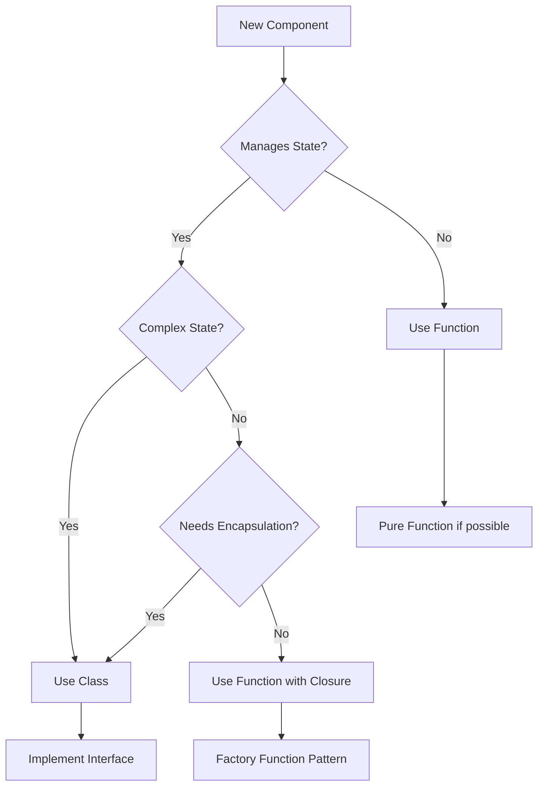

# Hybrid Architecture Standard

**Version**: 1.0.0  
**Adopted**: 2025-09-08  
**Status**: Active

## Executive Summary

This document establishes the hybrid programming paradigm as the standard approach for all Base SwapWatch development. We combine class-based programming for stateful infrastructure with function-based programming for business logic, leveraging the strengths of both paradigms.

## Core Principle

> **Use the right tool for the right job:**  
> Classes for stateful infrastructure, Functions for business logic

---

## Architecture Layers

### 1. Infrastructure Layer (Class-Based)

**When to use classes:**
- Managing connections (Redis, Database, WebSocket)
- Maintaining state (Rate limiters, Token buckets)
- Resource management (Connection pools, Buffers)
- Complex initialization sequences
- Private methods and encapsulation needed

**Standard Pattern:**
```typescript
// Infrastructure classes maintain state and manage resources
export class RateLimiter {
  private tokens: number;
  private lastRefill: number;
  private queue: Queue<() => void>;

  constructor(private readonly config: RateLimiterConfig) {
    this.tokens = config.requestsPerSecond;
    this.lastRefill = Date.now();
  }

  async execute<T>(fn: () => Promise<T>): Promise<T> {
    await this.acquire();
    return fn();
  }

  private acquire(): Promise<void> {
    // Stateful logic
  }
}
```

### 2. Business Logic Layer (Function-Based)

**When to use functions:**
- Data transformations
- Pure calculations
- API endpoint handlers
- Business rules and validations
- Composable service logic

**Standard Pattern:**
```typescript
// Pure business logic functions
export const calculateUsdValue = (
  amount: string,
  price: string,
  decimals: number
): string => {
  return new BigNumber(amount)
    .dividedBy(10 ** decimals)
    .multipliedBy(price)
    .toFixed(2);
};

// Service functions with dependencies
export const createEnrichmentService = (deps: Dependencies) => {
  const enrichSwapEvent = async (event: SwapEvent): Promise<EnrichedSwapEvent> => {
    // Use class-based infrastructure
    const cached = await deps.cache.get(event.tokenAddress);
    if (cached) return cached;

    // Business logic as functions
    const enriched = await fetchAndTransform(event);
    
    // Store using infrastructure
    await deps.cache.set(event.tokenAddress, enriched);
    return enriched;
  };

  return { enrichSwapEvent };
};
```

### 3. Orchestration Layer (Function-Based with DI)

**Standard Pattern:**
```typescript
// Service factory with dependency injection
export const createApiServices = (infrastructure: Infrastructure) => {
  const { cache, rateLimiter, logger } = infrastructure;

  const getDexScreenerData = async (address: string): Promise<MarketData> => {
    return rateLimiter.execute(async () => {
      const cached = await cache.get(`market:${address}`);
      if (cached) return cached;

      const data = await fetchDexScreenerApi(address);
      await cache.set(`market:${address}`, data, 300);
      return data;
    });
  };

  const getBaseScanData = async (address: string): Promise<VerificationData> => {
    // Similar pattern
  };

  return {
    getDexScreenerData,
    getBaseScanData,
    enrichSwapEvent: createSwapEnricher({ getDexScreenerData, getBaseScanData })
  };
};
```

---

## Decision Tree



---

## Standard Patterns

### Pattern 1: Infrastructure Class

```typescript
interface IInfrastructureService {
  initialize(): Promise<void>;
  healthCheck(): Promise<boolean>;
  shutdown(): Promise<void>;
}

export class ConcreteInfrastructure implements IInfrastructureService {
  private state: State;

  constructor(private readonly config: Config) {}

  async initialize(): Promise<void> {
    // Complex initialization
  }

  async healthCheck(): Promise<boolean> {
    // Check internal state
  }

  async shutdown(): Promise<void> {
    // Cleanup resources
  }
}
```

### Pattern 2: Service Factory

```typescript
type ServiceFactory<T> = (deps: Dependencies) => T;

export const createService: ServiceFactory<MyService> = (deps) => {
  // Private helper functions
  const helper = (data: Data): ProcessedData => {
    // Pure transformation
  };

  // Public API
  return {
    process: async (input: Input): Promise<Output> => {
      const data = await deps.fetch(input);
      const processed = helper(data);
      await deps.store(processed);
      return processed;
    }
  };
};
```

### Pattern 3: Pure Business Logic

```typescript
// Pure functions for business logic
export const pureBusinessLogic = {
  calculateFees: (amount: bigint, feeRate: number): bigint => {
    return (amount * BigInt(feeRate)) / 10000n;
  },

  validateSwap: (swap: Swap): ValidationResult => {
    const errors: string[] = [];
    
    if (swap.amountIn <= 0) {
      errors.push('Invalid input amount');
    }
    
    if (!isValidAddress(swap.tokenIn)) {
      errors.push('Invalid input token address');
    }

    return {
      valid: errors.length === 0,
      errors
    };
  },

  transformEventData: (raw: RawEvent): NormalizedEvent => {
    return {
      ...raw,
      timestamp: new Date(raw.timestamp),
      amounts: normalizeAmounts(raw.amounts)
    };
  }
};
```

### Pattern 4: Dependency Injection Container

```typescript
// Initialize all infrastructure (classes)
export const initializeInfrastructure = async (config: Config): Promise<Infrastructure> => {
  const cache = new CacheManager(config.redis);
  await cache.initialize();

  const rateLimiter = new RateLimiter(config.rateLimit);
  
  const logger = new Logger(config.logging);

  return {
    cache,
    rateLimiter,
    logger
  };
};

// Create all services (functions)
export const createServices = (infrastructure: Infrastructure): Services => {
  return {
    api: createApiServices(infrastructure),
    enrichment: createEnrichmentServices(infrastructure),
    processing: createProcessingServices(infrastructure)
  };
};

// Wire everything together
export const bootstrap = async (config: Config) => {
  const infrastructure = await initializeInfrastructure(config);
  const services = createServices(infrastructure);
  
  return {
    infrastructure,
    services,
    shutdown: async () => {
      await infrastructure.cache.disconnect();
      await infrastructure.logger.flush();
    }
  };
};
```

---

## File Organization

```
src/
├── infrastructure/           # Class-based stateful services
│   ├── cache/
│   │   ├── CacheManager.ts
│   │   └── ICacheManager.ts
│   ├── rate-limiter/
│   │   ├── RateLimiter.ts
│   │   └── IRateLimiter.ts
│   └── logger/
│       ├── Logger.ts
│       └── ILogger.ts
│
├── services/                 # Function-based business services
│   ├── dexscreener/
│   │   ├── index.ts         # Export createDexScreenerService
│   │   ├── types.ts
│   │   └── transformers.ts
│   ├── basescan/
│   │   └── index.ts
│   └── enrichment/
│       ├── index.ts
│       └── calculators.ts   # Pure functions
│
├── lib/                      # Shared utilities (mostly functions)
│   ├── validators.ts
│   ├── transformers.ts
│   └── constants.ts
│
├── types/                    # TypeScript type definitions
│   ├── api.ts
│   ├── domain.ts
│   └── infrastructure.ts
│
└── index.ts                  # Bootstrap and wire dependencies
```

---

## Guidelines

### DO ✅

1. **Use classes for:**
   - Redis, Database connections
   - Rate limiters, Queues
   - WebSocket connections
   - File system watchers
   - Any stateful infrastructure

2. **Use functions for:**
   - API route handlers
   - Data transformations
   - Business calculations
   - Validation logic
   - Service orchestration

3. **Always:**
   - Define interfaces for classes
   - Use dependency injection
   - Keep functions pure when possible
   - Type everything explicitly
   - Write tests for both paradigms

### DON'T ❌

1. **Don't use classes for:**
   - Simple data transformations
   - Stateless utilities
   - Pure calculations
   - One-off handlers

2. **Don't use functions for:**
   - Managing connection pools
   - Maintaining complex state
   - Resource lifecycle management

3. **Never:**
   - Mix paradigms in same file
   - Use `any` type
   - Mutate shared state in functions
   - Create deep inheritance hierarchies
   - Use classes just for namespacing

---

## Testing Strategy

### Testing Classes

```typescript
describe('RateLimiter', () => {
  let rateLimiter: RateLimiter;

  beforeEach(() => {
    rateLimiter = new RateLimiter({ requestsPerSecond: 5 });
  });

  it('should enforce rate limit', async () => {
    const results = await Promise.all(
      Array(10).fill(0).map(() => 
        rateLimiter.execute(() => Promise.resolve(Date.now()))
      )
    );
    
    const duration = results[9] - results[0];
    expect(duration).toBeGreaterThan(1800); // ~2 seconds for 10 requests at 5/sec
  });
});
```

### Testing Functions

```typescript
describe('calculateUsdValue', () => {
  it('should calculate correctly with decimals', () => {
    const result = calculateUsdValue('1000000', '1.5', 6);
    expect(result).toBe('1.50');
  });
});

describe('createEnrichmentService', () => {
  it('should use cache when available', async () => {
    const mockCache = {
      get: jest.fn().mockResolvedValue({ cached: true }),
      set: jest.fn()
    };
    
    const service = createEnrichmentService({ cache: mockCache });
    const result = await service.enrichSwapEvent(mockEvent);
    
    expect(mockCache.get).toHaveBeenCalled();
    expect(mockCache.set).not.toHaveBeenCalled();
  });
});
```

---

## Migration Guide

### From Pure Class-Based

```typescript
// BEFORE: Everything in classes
class SwapProcessor {
  constructor(private deps: AllDependencies) {}
  
  processSwap(swap: Swap): ProcessedSwap {
    return this.transform(this.validate(swap));
  }
  
  private validate(swap: Swap): ValidatedSwap { }
  private transform(swap: ValidatedSwap): ProcessedSwap { }
}

// AFTER: Hybrid approach
// Infrastructure stays as class
class CacheManager { /* ... */ }

// Business logic as functions
const validateSwap = (swap: Swap): ValidatedSwap => { };
const transformSwap = (swap: ValidatedSwap): ProcessedSwap => { };

export const createSwapProcessor = (cache: CacheManager) => ({
  processSwap: async (swap: Swap): Promise<ProcessedSwap> => {
    const cached = await cache.get(swap.id);
    if (cached) return cached;
    
    const validated = validateSwap(swap);
    const processed = transformSwap(validated);
    
    await cache.set(swap.id, processed);
    return processed;
  }
});
```

### From Pure Function-Based

```typescript
// BEFORE: Everything as functions
const cache = createCache(config);
const rateLimiter = createRateLimiter(config);

// AFTER: Hybrid approach
// Stateful infrastructure as classes
const cache = new CacheManager(config);
const rateLimiter = new RateLimiter(config);

// Business logic remains as functions
const processData = (data: Data): ProcessedData => { };
```

---

## Performance Considerations

1. **Classes have slight overhead** for instantiation but provide better encapsulation for complex state
2. **Functions are more performant** for simple operations and compose better
3. **Use connection pooling** in infrastructure classes
4. **Keep functions pure** for easier memoization
5. **Leverage TypeScript's type inference** to reduce verbosity

---

## Conclusion

The hybrid approach gives us the best of both worlds:
- **Reliability** from class-based infrastructure
- **Flexibility** from functional business logic
- **Testability** through dependency injection
- **Maintainability** through clear separation of concerns

This standard ensures consistent, high-quality code across the Base SwapWatch project while leveraging the strengths of both programming paradigms.