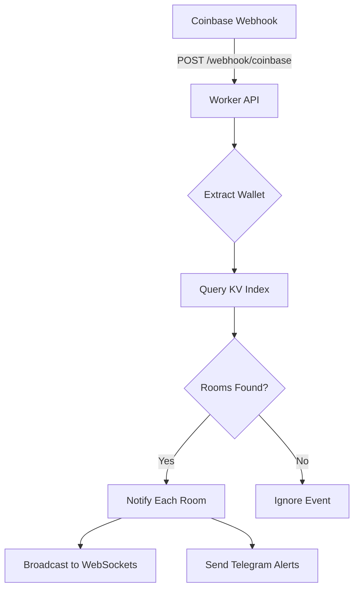

# CDP Webhook Configuration Guide

## Architecture Overview

SwapWatch uses a **single webhook endpoint architecture** with dynamic filter management:
- **One webhook endpoint** for all rooms (`/webhook/coinbase`)
- **Dynamic wallet filters** automatically updated via CDP API
- **KV-based index** for efficient wallet-to-room routing
- **Automatic filter synchronization** when wallets are added/removed

## Current Setup

### 1. Webhook Created ✅
- **Endpoint:** `https://api.swapwatch.app/webhook/coinbase`
- **Network:** Base Mainnet
- **Event Type:** Wallet Activity
- **Signature:** Matches production secret

### 2. Wallet Index System ✅
- Bi-directional KV index tracks wallet-room relationships
- Webhook events are routed to appropriate rooms
- Multiple rooms can track the same wallet

### 3. Dynamic Filter Updates (Optional)
The system can automatically update CDP webhook filters when wallets are added/removed from rooms.

## Enabling Dynamic Filter Updates

To enable automatic webhook filter updates, you need to set CDP API credentials:

### Step 1: Get Your CDP API Credentials

1. Go to [Coinbase Developer Platform](https://portal.cdp.coinbase.com/)
2. Navigate to your project settings
3. Find your API credentials:
   - API Key Name
   - API Key Private Key
4. Note your Webhook ID from the webhook dashboard

### Step 2: Set Worker Secrets

```bash
# Set CDP API credentials
echo "YOUR_WEBHOOK_ID" | wrangler secret put CDP_WEBHOOK_ID --env production
echo "YOUR_API_KEY_NAME" | wrangler secret put CDP_API_KEY_NAME --env production
echo "YOUR_API_KEY_PRIVATE_KEY" | wrangler secret put CDP_API_KEY_PRIVATE_KEY --env production
```

### Step 3: How It Works

Once configured:
1. When a wallet is added to a room → Updates CDP webhook filters
2. When a wallet is removed → Updates CDP webhook filters
3. When a room expires → Cleans up filters

## Manual Filter Management

If you prefer not to use dynamic filters:
1. The system will still work using KV index
2. Webhook receives all Base Mainnet activity
3. Events are filtered server-side based on KV index

## Testing the Webhook

### 1. Monitor Worker Logs
```bash
wrangler tail --env production
```

### 2. Create a Test Room
```bash
curl -X POST https://api.swapwatch.app/room/TEST001/create \
  -H "Content-Type: application/json" \
  -d '{"threshold": 1000}'
```

### 3. Add a Wallet to Track
```bash
curl -X POST https://api.swapwatch.app/room/TEST001/wallets \
  -H "Content-Type: application/json" \
  -d '{"address": "0xYourWalletAddress"}'
```

### 4. Verify Index
Check KV storage to see wallet mapping:
```bash
wrangler kv key list --namespace-id bb200532d7c04a3fa9110a9fb2d7d294 --prefix wallet:
```

## Webhook Flow



## Troubleshooting

### Webhook Not Receiving Events
- Check webhook is active in CDP dashboard
- Verify signature matches production secret
- Check Worker logs for errors

### Wallets Not Being Tracked
- Verify wallet was added to a room
- Check KV index has wallet entry
- Ensure room hasn't expired

### Dynamic Filters Not Updating
- Verify CDP API credentials are set
- Check Worker logs for CDP API errors
- Ensure webhook ID is correct

## Security Notes

- **Webhook signature** is verified on every request
- **CDP API credentials** are stored as Worker secrets
- **Wallet addresses** are normalized to lowercase in index
- **Room codes** are case-sensitive

## Next Steps

1. Frontend integration (Task 4)
2. WebSocket real-time updates (Task 5)
3. Telegram notifications
4. Enhanced swap event enrichment