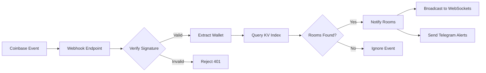

# SwapWatch Documentation

## Overview

SwapWatch is a real-time cryptocurrency swap monitoring platform built on Cloudflare's edge infrastructure. It tracks wallet activity on Base network and provides instant notifications through WebSockets and Telegram.

## 📚 Documentation Index

### Core Documentation

1. **[Developer Guide](./DEVELOPER_GUIDE.md)** - Complete setup and development guide
2. **[API Documentation](./API_DOCUMENTATION.md)** - Full API reference with examples
3. **[Webhook Architecture](./WEBHOOK_ARCHITECTURE.md)** - Single webhook endpoint design
4. **[Wallet Index Guide](./WALLET_INDEX_GUIDE.md)** - KV index implementation details

### Setup Guides

5. **[CDP Webhook Setup](../CDP_WEBHOOK_SETUP.md)** - Coinbase webhook configuration
6. **[CDP Webhook Utils](./CDP_WEBHOOK_UTILS.md)** - Webhook management tool guide
7. **[Security Checklist](../SECURITY_CHECKLIST.md)** - Credential security guide

## 🏗️ Architecture

### Single Webhook Architecture

SwapWatch uses a **single webhook endpoint** with dynamic filter management:

```
Coinbase CDP → Single Webhook → KV Index → Multiple Rooms → WebSocket Clients
```

**Key Benefits:**
- ✅ Simple setup - one webhook for all rooms
- ✅ No CDP quota issues
- ✅ Efficient routing via KV index
- ✅ Dynamic filter updates
- ✅ Wallets can be in multiple rooms

### Core Components

| Component | Purpose | Technology |
|-----------|---------|------------|
| **Worker API** | HTTP/WebSocket endpoints | Cloudflare Workers |
| **Durable Objects** | Room state management | Cloudflare Durable Objects |
| **KV Index** | Wallet-to-room mapping | Cloudflare KV |
| **CDP Webhook** | Blockchain events | Coinbase Developer Platform |
| **Filter Manager** | Dynamic wallet filtering | CDP API |

## 🚀 Quick Start

### 1. Prerequisites

- Node.js 18+ and pnpm
- Cloudflare account
- Coinbase CDP account
- Wrangler CLI installed

### 2. Setup

```bash
# Clone repository
git clone https://github.com/keentechcodes/Base-SwapWatch.git
cd Base-SwapWatch

# Install dependencies
pnpm install

# Configure environment
cp .env.example .env
# Edit .env with your credentials

# Deploy to Cloudflare
wrangler deploy --env production
```

### 3. Configure Webhook

```bash
# Use the webhook utility
./cdp-webhook-utils.sh

# Or manually via CDP dashboard
# URL: https://api.swapwatch.app/webhook/coinbase
# Network: Base Mainnet
# Event Type: Wallet Activity
```

## 📡 API Endpoints

### Room Management
- `POST /room/{roomCode}/create` - Create room
- `GET /room/{roomCode}/wallets` - List wallets
- `POST /room/{roomCode}/wallets` - Add wallet
- `DELETE /room/{roomCode}/wallets/{address}` - Remove wallet
- `GET /room/{roomCode}/websocket` - WebSocket connection

### Webhook
- `POST /webhook/coinbase` - Receive CDP events

### Health
- `GET /health` - API status check

See [API Documentation](./API_DOCUMENTATION.md) for complete reference.

## 🔄 Webhook Flow



## 🔑 Security

### Credentials Management

- **Local Development:** Store in `.env` file (gitignored)
- **Production:** Use Wrangler secrets
- **Never:** Commit credentials to repository

### Required Secrets

```bash
# Webhook signature verification
COINBASE_WEBHOOK_SECRET

# CDP API (for dynamic filters)
CDP_API_KEY_NAME
CDP_API_KEY_PRIVATE_KEY
CDP_WEBHOOK_ID

# Notifications (optional)
TELEGRAM_BOT_TOKEN
```

See [Security Checklist](../SECURITY_CHECKLIST.md) for best practices.

## 🛠️ Development

### Local Testing

```bash
# Start local Worker
wrangler dev

# Run tests
npm test

# Tail production logs
wrangler tail --env production
```

### Project Structure

```
├── src/
│   └── worker/
│       ├── index.ts              # Main Worker entry
│       ├── RoomDurableObject.ts  # Room state management
│       ├── wallet-index.ts       # KV index operations
│       ├── cdp-webhook-manager.ts # Filter management
│       └── room/                 # Room logic modules
├── docs/                         # Documentation
├── scripts/                      # Utility scripts
└── wrangler.toml                # Worker configuration
```

## 📊 Monitoring

### Health Checks

```bash
# API health
curl https://api.swapwatch.app/health

# Room status
curl https://api.swapwatch.app/room/{roomCode}/presence

# Webhook status
./cdp-webhook-utils.sh list
```

### Debug Commands

```bash
# View Worker logs
wrangler tail --env production

# Check KV index
wrangler kv key list --namespace-id YOUR_KV_ID --prefix wallet:

# Test webhook
curl -X POST https://api.swapwatch.app/webhook/coinbase \
  -H "x-webhook-signature: {signature}" \
  -d '{"test": "event"}'
```

## 🚧 Troubleshooting

### Common Issues

| Issue | Solution |
|-------|----------|
| Webhook not receiving events | Check CDP dashboard, verify signature |
| Wallets not tracked | Verify KV index, check room expiration |
| WebSocket connection fails | Check CORS, verify room exists |
| Filter updates failing | Verify CDP API credentials |

See [Developer Guide](./DEVELOPER_GUIDE.md#troubleshooting) for detailed solutions.

## 📈 Performance

### Current Limits
- **Wallets per room:** 20
- **Rooms per wallet:** Unlimited
- **Total wallets:** Unlimited (KV scales)
- **Events/second:** 1000+ (Worker auto-scales)

### Cost Estimate (1000 rooms)
- Worker requests: ~$5/month
- KV operations: ~$10/month
- Durable Objects: ~$15/month
- **Total:** ~$30/month

## 🔄 Updates

### Recent Changes
- Single webhook architecture implementation
- Dynamic CDP filter management
- KV-based wallet index
- WebSocket hibernation support
- Comprehensive documentation

### Roadmap
- [ ] Frontend deployment (Cloudflare Pages)
- [ ] Enhanced swap enrichment
- [ ] Analytics dashboard
- [ ] Mobile app support

## 📝 Contributing

1. Fork the repository
2. Create feature branch
3. Add tests for changes
4. Update documentation
5. Submit pull request

## 📄 License

MIT License - See [LICENSE](../LICENSE) file

## 🆘 Support

- **Documentation:** Check `/docs` folder
- **Issues:** [GitHub Issues](https://github.com/keentechcodes/Base-SwapWatch/issues)
- **Logs:** Use `wrangler tail` for debugging

---

## Quick Links

- [API Documentation](./API_DOCUMENTATION.md)
- [Webhook Architecture](./WEBHOOK_ARCHITECTURE.md)
- [Developer Guide](./DEVELOPER_GUIDE.md)
- [Security Checklist](../SECURITY_CHECKLIST.md)

---

*Last Updated: October 2025*